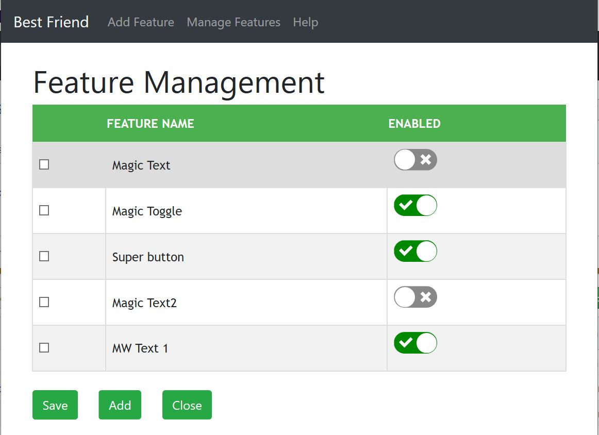

# Feature management toggle tool
## Scope
The aim of this assignment is to produce a tool that will allow a  operations member to quickly turn features on and off.
This is achieved by marking the feature in the front end with an appropriate tag. Once established, a database will be configured with this tag and the page should check the enablement flag at each render.

## The Stack

Front end  | Web protocol helper   | Service  | Web service listener | Database Driver  | Database
---|---|---|---|---|---
React.js | Axios | Java | Spring | jdbc | MySql

# MySql
I've had experience with Oracle and was happy to use this. However, MySql was recommended  for  a local application that's hosted on a windows operating system, where Oracle would normally be hosted on Unix/Linux servers. 
Originally, I created two databases. One for credentials and the other for the features. This was to separate out the purpose and look to more secure infrasturcture. Whilst it is possible to host more than one database and use a Maven Java project with Spring, the configuration of this required a lot of thought and trial and error.  I managed to break my project doing through the experiments. So, took the step to revert and host my credentials table on the feature database.
I started with generating the feature database with a number of options. I wanted to filter features to specific groups and users. I generated some matrices to handle this, but with the technical spikes, I've not had the opportunity to implement these.
I've generated a new user to both databases. Credentials only has select / execute privileges. Features has a user that can perform all data privileges, but no DDL rights. This is to prevent database corruption and to remove the root credentials from out of my code.
When working the access table back into the features database, I enhanced the privileges on this table using a grant to restrict to only select execute on the table and function.
  
  ![Schema Diagram] (feaureDBdiagram.png)

## jdbc
As I'm using MySql database with stored procedures, Spring cannot be used as it does not interface to stored procedures. It's used with the  CRUD capability of the database.
I implemented the jdbc driver management and coded a number of queries statements. In attempting to get a proper Json string, I found GSON. This is used to work with jdbc and ensure a Json dataset. It also helped to reduce the amount of driver configuration required in the code.

## Java
I've coded in a number of other languages and this training has introduced my to Java. So, taking my learning onboard I have produced a handful of APIs to return or update data. 
	* /access/{id}/{access}
	* /applications
	* /features/{appID}

Access is used to validate credentials
Applications returns a list to be used in a drop down menu on the login page.
Features returns the dataset for the relevant application.

There are a number of Java projects that can be implemented with various frameworks. I've opted for mavern as this has thousands of APIs to choose from to improve code. An example I used is with GSON. This improved my code when retrieving data.

## Spring
An engine to provide an interface for the API endpoints. It can also be used to interface the service with the database. I implemented into my services.
In using it, there is a wealth of functionality. I was steered against using it for my database calls as I was informed that it does not work with stored procedures. In the last days of the project, I realised that you can use Spring to call the stored procedures and functions. I attempted a couple of POCs, but the code got messed up and I reverted it back out again. 

## Axios
I did look at XmlHttpRequest and Fetch, both perform similar HTTP functionality to the Axios. 
Axios was a tool introduced in class and gave me mostly the responses I required. The other tools produced the same object response.
I do have problems with Axios. There is a requirement to asynchronise the call and apply an await. However, the response is returned as a promise. Handling the promise to pick up the Json string was still assigning the response as a promise object. This demanded a lot of data handling to extract the string arrays from the objects. I was not successful in just producing the string as required. A lot of examples that I could of implemented to give me better styling of data presentation had to be binned. I eventually handled the promise in the get function and return a Json string to the React page . This issue took up a considerable amount of my time and compromised the deliverable. The trainers were also stumped as to providing a solution.

## React
I choose React as I wanted to invest some of the on-line training into an actual deliverable. To work out it's nuances and become better at producing artefacts. The javaScript training has been good for coalescing my previous understanding and gaps. 

I've incorporated a simple login screen that also asks for an application. The thought behind this is that the tool can be used over multiple applications and allow quick feature changes.
Once you've logged in, you're presented with the existing features or a requested to add. Alongside each feature is a toggle button. You're required to change the toggle(s) and save to update the database.
The user then has the ability to add new feature toggles.

I had issues with the tool. FOr example, when I created the Add Feature Component, the container routing issued compile errors. The Component was in the same format as the other components. The routing instruction was no different, but it woudl not load the component properly. I eventually created a new component with the same code and this worked. Just wasted my time.

